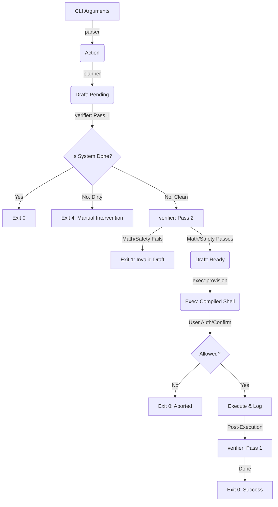

# lvq Architecture & Internal Design

This document serves as the primary architectural reference for the `lvq` project. It bridges the gap between high-level system goals and the concrete implementation details found in the `src/` directory. If you are new to the codebase, read this document sequentially to understand the flow of data and the strict boundaries between our internal modules.

## High-Level Concept & Design Philosophy

`lvquick` (`lvq`) is a Rust-based transactional wrapper for LVM2, engineered to eliminate high-risk storage mistakes. Instead of acting as a simple script that blindly executes shell commands, `lvq` operates as a deterministic state-convergence engine. It takes a desired end-state, compares it against the actual live system, and generates a precise, journaled execution plan to bridge the gap safely. 

The architecture is explicitly designed to be extensible. While initially focused on safe volume provisioning, the foundation is built to support a full suite of complex, recoverable storage operations—such as live disk replacements, SSD caching, and data evacuation—as outlined in the project's v1.0 roadmap.

**Core Design Principles:**
* **Transactional Execution:** The system enforces a strict **Plan → Verify → Confirm → Execute** lifecycle. Every high-risk storage operation is fully journaled, ensuring deterministic execution and laying the groundwork for robust rollback capabilities on failure.
* **Declarative Intent:** Users specify *what* they want (e.g., "A 10GB LV with XFS"), not *how* to build it.
* **Provable Safety Over Speed:** Destructive operations (like disk formatting and shrinking) are guarded by multi-pass verification, live system state probes, and formal correctness checks.
* **Strict Separation of Concerns:** Parsing, planning, verification, and execution are rigidly isolated modules. Data flows strictly in one direction to ensure the core logic remains completely decoupled from OS-level side effects until the final execution phase.
* **Idempotency by Default:** Running the same `lvq` command twice must result in zero changes to the system on the second run, exiting cleanly and safely.

## System Flow (The Data Pipeline)

The architecture is built around a linear data pipeline. A raw string input is progressively enriched, transformed, and verified until it becomes a secure execution plan. 

### Type Transformations

1. **Raw Input:** The user provides arguments via `std::env::args()`.
2. **`Action`:** The `parser` validates the syntax and translates the strings into a declarative `Action`.
3. **`Draft` (Pending):** The `planner` translates the `Action` into a `Draft`, mapping the intent to an ordered list of abstract `Call` instructions.
4. **`Draft` (Ready/Done/Dirty):** The `verifier` queries the OS to build a `SystemState` snapshot. It checks the `Draft` against this state.
5. **`Exec`:** The `exec` module compiles the verified abstract `Call`s into raw, concrete shell commands ready for execution.

## Core Components & Internal Representation

The `src/core/mod.rs` file defines the central vocabulary of the application. By centralizing these types, we prevent tight coupling between the independent modules.

### Domain Types

* **`SizeUnit`:** A robust enum handling absolute sizes (Bytes to Exabytes), sector counts, extents, and relative percentages (`ValidPercentage`). It contains the critical `to_bytes()` translation logic.
* **`Filesystem`:** An enum representing supported formats (`Xfs`, `Ext4`, `Swap`, etc.).
* **`LvRequest`:** Represents a single logical volume configuration parsed from the `--lv` flag (e.g., `name:size:fs:mount`).

### The `Call` Enum (Intermediate Representation)

The `Call` enum is the most important abstraction in `lvq`. It bridges user intent and shell commands. By keeping operations abstract (e.g., `Call::Mkfs { device, fs }`) during the planning and verification phases, we can reason about the system safely without worrying about shell escaping or specific binary flags.

| Variant | Purpose |
| --- | --- |
| `PvCreate` | Marks a block device as a Physical Volume. |
| `VgCreate` | Aggregates PVs into a Volume Group with a specific PE size. |
| `LvCreate` | Carves out logical capacity from a VG. |
| `Mkfs` | Formats a block device with a specific filesystem. |
| `MkSwap` | Formats and activates swap space. |
| `Mkdir` | Ensures mount point paths exist. |
| `Mount` | Temporarily mounts a filesystem. |
| `Fstab` | Persistently registers a mount in `/etc/fstab`. |--

## The Verification Engine (The Brain)

Located in `src/verifier/`, this module is responsible for the intelligence and safety of `lvq`. It operates in two distinct passes against a live model of the host machine.

### The `SystemState` Snapshot

Before validating anything, the verifier invokes external LVM and Linux utilities (`pvs`, `lsblk`, `/proc/mounts`, `/etc/fstab`) to build a `SystemState` struct. This acts as an in-memory, read-only replica of the host's current block storage configuration.

### Pass 1: State Convergence (`verify_done`)

The engine checks how many of the proposed `Call`s already exist in the `SystemState`.

* **Done:** If 100% of the required state exists, the system gracefully exits (`0`).
* **Clean:** If 0% of the required state exists, the draft is a fresh deployment and proceeds.
* **Dirty:** If a partial state exists (e.g., the VG exists, but the LV does not), `lvq` refuses to guess the user's intent, aborts with a `Dirty` status, and exits with code `4`.

### Pass 2: Feasibility & Safety (`verify_possible`)

If the system is `Clean`, the engine validates that the requested operations are mathematically and physically possible.

* **Uniqueness:** Ensures no duplicate PVs or LVs are declared.
* **Safety Checks:** Prevents formatting devices that are already referenced in `/etc/fstab` or have existing filesystem signatures. It also issues warnings if raw disks are targeted instead of partitions.
* **Capacity Math:** Calculates total available extents based on block device sizes minus LVM metadata overhead (1MB), and proves that the requested LV allocations do not exceed physical capacity.

## Execution & Translation Engine

Located in `src/exec/`, this module acts as the "compiler backend" for `lvq`. Once a `Draft` has been thoroughly verified and marked as `Ready`, this engine translates the abstract `Call` intermediate representation (IR) into an `Exec` struct containing concrete shell strings.

### The Translation Layer (`exec::provision`)
This step is entirely deterministic and relies heavily on the `SizeUnit::to_bytes()` logic to ensure exact disk geometry allocation. For example, a `Call::LvCreate` with a `SizeUnit::Percentage` is translated into the precise `lvcreate -l %{TARGET}` syntax.

### Defensive Operations
The execution engine is designed with defensive system administration in mind. 
* **Safe `fstab` Appending:** Instead of blindly echoing into `/etc/fstab`, the engine creates a backup (`.bak`), writes the new entry to a temporary file (`.tmp`), dynamically resolves the block device to a `UUID` via `blkid` to guarantee persistent mounting across reboots, and finally moves the `.tmp` file into place.
* **State Reloads:** Any mutation to `fstab` automatically queues a `systemctl daemon-reload` instruction to ensure the host `systemd` process synchronizes with the new disk state.

## Security, Authorization & Auditing

Because `lvq` executes destructive shell commands (like `mkfs` and `vgcreate`), security and user authorization are enforced at multiple levels in `src/main.rs` and `src/exec/mod.rs`.

### Identity & Authorization Gates
1. **Root Enforcement:** `lvq` immediately shells out to `id -u` on startup. If the caller is not `0` (root), the process exits with code `1` before parsing even begins.
2. **The Confirmation Gate (`confirm_execution`):** Unless invoked with `-y` or `--auto-confirm`, the compiled execution plan is printed to `stdout` along with any system warnings. The user must explicitly type `Y`. 
3. **The `is_allowed` Boundary:** The `Exec` struct contains a hardcoded `is_allowed` boolean that defaults to `false`. The `apply_execution` function strictly refuses to run if this flag has not been flipped by the authorization gate.

### Forensic Auditing
All execution loops are strictly append-only and log heavily to `/var/log/lvq`. 
* Every command is logged with its `INTENT`.
* If a command succeeds, it is marked `SUCCESS`.
* The execution loop **fails fast**. If any `sh -c` invocation returns a non-zero exit code, the engine immediately logs `FAILED`, aborts the rest of the queue, and bubbles the error up.

## Correctness & Formal Verification

Because lvq operates on destructive block storage commands, we maintain an exhaustive, multi-layered testing harness encompassing formal proofs, fuzzing, proptests, and eventually ephemeral VM E2E testing. For a deep dive into what these tests do, how to run them and where to find these tests, see docs/testing.md. I strongly encourage to go an read that file to understand the thorough approach this project takes for testing. 

## Error Handling & Diagnostics

`lvq` strictly avoids panicking in the wild. All internal modules communicate failures by bubbling up `Result<T, String>`, allowing `main.rs` to control the standard error output (`eprintln!`) and exit gracefully.

### Standardized Exit Codes
Scripts consuming `lvq` can rely on strict POSIX-style exit codes to determine the system's state:
* `0` **(Success):** The system successfully converged, *or* it was already in the `Done` state and no changes were required.
* `1` **(General Error):** Used for non-root access, malformed CLI parsing, invalid capacity math, or a hard failure during the shell execution loop.
* `4` **(Dirty State):** A critical architectural exit code. Returned if the Verifier detects a partial/fractured LVM state prior to execution, *or* if the post-execution state verification fails to match the original `Draft`. Requires manual sysadmin intervention.

## OS Boundaries & External Dependencies

`lvq` does not implement LVM via raw kernel syscalls; it relies on the host's userspace tools. For `lvq` to operate, the target machine must have the following binaries available in the system `$PATH`:

* **LVM2 Suite:** `pvs`, `vgs`, `lvs`, `pvcreate`, `vgcreate`, `lvcreate`
* **Block Devices & Mounts:** `lsblk`, `blkid`, `mount`, `mkdir`
* **Filesystems:** `mkfs` (and target-specific helpers like `mkfs.xfs`, `mkfs.ext4`), `mkswap`, `swapon`
* **System utilities:** `sh`, `cp`, `mv`, `echo`, `id`, `systemctl`

## Historical Context & Decisions

The reasoning behind major architectural pivots and design constraints is documented chronologically in the `devlogs/` directory. Rather than bloating this architecture document, refer to the devlogs for historical context:

* *Refer to `devlogs/devlog-01.md` through `devlog-14.md` for context on early parsing decisions, the migration to the multi-pass verification model, and the introduction of formal Kani proofs.*
